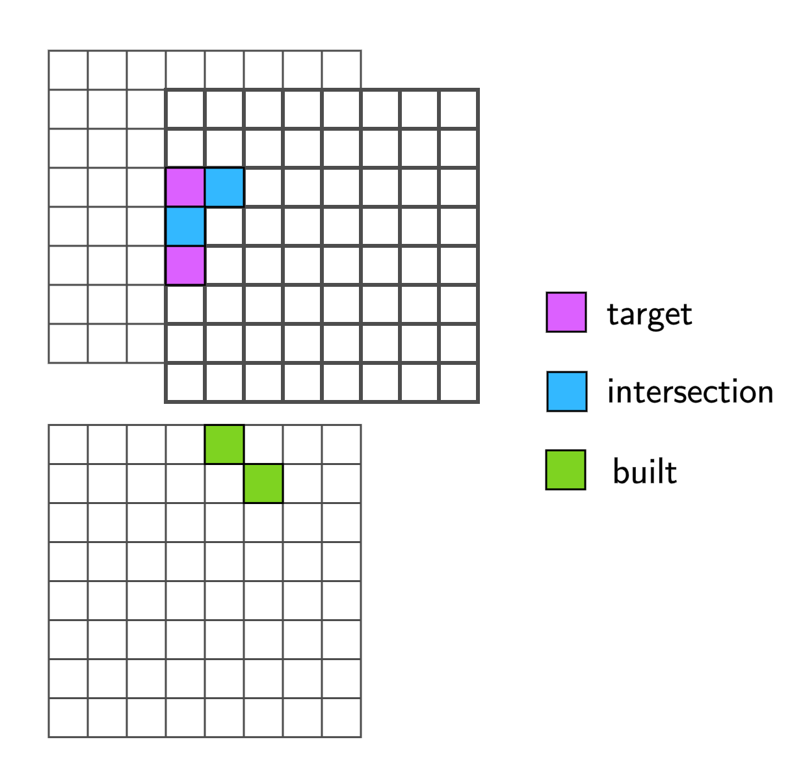

# **[NeurIPS 2022 - IGLU Challenge](https://www.aicrowd.com/challenges/neurips-2022-iglu-challenge)** - Baseline agent

Quick Links:

* [The IGLU Challenge - Competition Page](https://www.aicrowd.com/challenges/neurips-2022-iglu-challenge)
* [The IGLU Challenge - Slack Workspace](https://join.slack.com/t/igluorg/shared_invite/zt-zzlc1qpy-X6JBgRtwx1w_CBqOV5~jaA&sa=D&sntz=1&usg=AOvVaw33cSaYXeinlMWYC6bGIe33)
* [The IGLU Challenge - Starter Kit](https://gitlab.aicrowd.com/aicrowd/challenges/iglu-challenge-2022)


# Table of Contents
1. [Overview](#)
2. [Baseline performance](#Baseline_performance)
3. [Visualization of the current baseline](#)
4. [Method description](#)
   1. General overview
   2. NLP module
   3. Heuristic module
   4. RL module
5. [Training data](#)
6. [Training process](#)
7. [Code structure](#)
7. 

# Overview

**Note:** before reading the baseline description, we highly encourage you to read the description in the competition [starter kit](https://gitlab.aicrowd.com/aicrowd/challenges/iglu-challenge-2022/iglu-2022-rl-task-starter-kit). Is document assumes familiarity with the RL [environment](https://github.com/iglu-contest/gridworld) and 

The Multitask Hierarchical Baseline (MHB) agent fully solves the IGLU RL task: it predicts which blocks needs to be placed from an instruction and then, it executes several actions in the evironment that lead to placements in responce to that instruction. It is comprised of three modules: NLP module that predicts blocks coordinates and ids given text, Heuristic module (pure python code) that iterates over the predicted blocks (where a heuristic defines order), and RL module that executes atomic task of one block placement or removal. The RL agent operates on a visual input, inventory, compass observation, and a target block.

# Baseline performance

Current baseline was trained in three days (?), the performance metrics are shown below.


Here, the two main metrics are Subtask Success rate and Task Success rate. The first one shows the success probability of one block placement. The second one shows the probability of sucess in building set of blocks in responce to an instruction (i.e. a chain of subtasks).

# Visualization

Below the visualization is shown. The agent is tasked to build a structure shown in the image. 


# Method description

## NLP Module (Task generator)

Text module predicts block coordinates and ids in an autoregressive fashion. It uses a finetuned [T5](https://huggingface.co/docs/transformers/model_doc/t5) encoder-decoder transformer. This model takes a dialog as an input and sparse blocks coordinates as outputs. The model was finetuned on the multiturn IGLU dataset available in the [azure storage](https://iglumturkstorage.blob.core.windows.net/public-data/iglu_dataset.zip) or in the [RL env](https://github.com/iglu-contest/gridworld) python package.

## Heuristic Module (Subtask generator)

This module is a pure python code that takes the output of the NLP module in the form of 3d voxel array of colored blocks, and creates a generator that yields blocks (one at a time) to add or remove, following certain heuristic. This is done since the RL module operates on one-block task basis. The heuristic rule is best described in the following animation:

Original figure (3D voxel)             |  Blocks order
:-------------------------:|:-------------------------:
 |  

## RL module (Subtask solver)

A reinforcement learning policy that takes a non-text part of an environment observation (agent's POV image, inventory state, compass), and a block to add or remove. Note that in case of several blocks added within environment episode, the RL agent "sees" them as several episodes (number of "internal" episodes is equal to the number of blocks). This is because its episodes are atomic and contain just one block to add/remove. The policy acts in the **walking** action space to have a better prior of building blocks on the ground. The model of the policy is uses 6-layers convolutional ResNet, with the same architecture as in the [IMPALA paper](https://arxiv.org/pdf/1802.01561.pdf). This model is used to process image and target grid (with shape `(9, 11, 11)` - (Y, X, Z)). The target grid is interpreted as an image with Y layers as channels. Once calculated, the ResNet embeddings of an image and a target are concatenated with an MLP embedding of compass and inventory and the whole vector is passed to the LSTM cell that output logits of a policy.

# Training data and process

(?) add training code description for the NLP module.

To train the RL module, we use a high-throughput [implementation](https://github.com/iglu-contest/sample-factory) of APPO algorithm. We train the model on a random tasks distribution, such that each sample is similar to the tasks in the dataset (in particular, multiturn [dataset](https://iglumturkstorage.blob.core.windows.net/public-data/iglu_dataset.zip)). We also modify the original reward function and set it to be proportional to the distance between the position of a placed block and it's target position (since the RL algorithm operates on a one block basis). We initialize the hidden state of LSTM of a polciy with zeros in the beginning of an episode and reset the hidden state once the target block is placed correctly. The model of a policy combines learned embeddings of image, target 3d array (where heights are interpreted as a channel), inventory and compass information in a single features vector that is passed to LSTM. We train the model for 2.5 billion environment steps using APPO. The performance (measured in a subtask success rate) plateaues after roughly 500 million environment steps (10-12 hours), but actual learning happens after since the task success rate starts growing exactly after that. For training we used two Titan RTX GPUs used for rendering and 50 workers for environment sampling. We observed the same per env step sample efficiency when trained with one renderer GPU and 16 workers (with lower wall time efficiency). Note that we believe a successful solution should not necessarily modify the RL agent. The baseline has a lot of moving parts such as NLP model and a heuristic blocks iterator.

# Performance distribution

To provide a better insight on what the agent's abilities are, we labeled all structures in the training dataset with a set of skills required for solving these tasks. 
There are 5 skills in total. Each skill describes a kind of gameplay style (action patterns) that the agent need to perform in the environment in order to build each srtucture. We emphasize that skills are properties of the block structures not the agents, in this sense. Here is the list of skills:

  * `flat` - flat structure with all blocks on the ground
  * `flying` - there are blocks that cannot be placed without removing some other blocks (i.e. )
  * `diagonal` - some blocks are adjacent (in vertical axis) diagonally
  * `tricky` - some blocks are hidden or there should be a specific order in which they should be placed
  * `tall` - a structure cannot be built without the agent being high enough (the placement radius is 3 blocks)

The skills labeling is provided [here](https://github.com/iglu-contest/gridworld/tree/master/skills) and rendered goal structures are present in `skills/renderings/` folder, under this link.

For each task, we calculate F1 score between built and target structures. 
For each skill, we average the performance on all targets requiring that skill. These metrics were calculated on 

| F1 score        | flying |tall |diagonal | flat   | tricky | all  |
|-----------------| ----- | -----| -------|--------|-------|------|
| MHB agent (NLP) | 0.292 | 0.322 | 0.242  |  0.334 | 0.295 | 0.313 |
| MHB agent (full)| 0.233 |0.243  | 0.161  |0.290   |  0.251|  0.258|
| Random agent (full)| 0.039|0.036  | 0.044  |0.038   |  0.043|  0.039|

# Installation

For this baseline version uses latest version of a `master` branch  from Iglu gridworld repository. You can install this version by the following command:

```bash
pip install git+https://github.com/iglu-contest/gridworld.git
```

Then install other requirements by running

```bash
pip install -r docker/requirements.txt
```

also, install a specific version of pytorch and sample-factor by running

```bash
pip3 install torch==1.8.1+cu111 torchvision==0.9.1+cu111 torchaudio==0.8.1 -f https://download.pytorch.org/whl/torch_stable.html 
pip3 install git+https://github.com/iglu-contest/sample-factory.git@1.121.3.iglu
pip3 install git+https://github.com/iglu-contest/gridworld.git@master
```

Alternatively, you can build the docker image to work with. This setup was tested and works stable:

```bash
./docker/build.sh
```

## Training APPO
Just run ```train.py``` with config_path:
```bash
python main.py --config_path iglu_baseline.yaml
```
## Enjoy baseline
Run ```enjoy.py``` :
```bash
python utils/enjoy.py
```

# Code structure

Now, function `target_to_subtasks` in wrappers/target_generator.py implements the main algorithm for splitting the goal into subtasks
Also, in  `wrappers/multitask` you can find `TargetGenerator` and `SubtaskGenerator` classes.
First class make full-figure target using `RandomFigure` generator or `DatasetFigure` generator.
Second class make subtasks for environment.


# Intro to IGLU Gridworld and the IGLU Challenge

Your goal of this challenge is to **build interactive agents** that learn to solve a task while provided with **grounded natural language instructions** in a **collaborative environment**.

#### A high level description of the Challenge Procedure:
1. **Sign up** to join the competition [on the AIcrowd website](https://www.aicrowd.com/challenges/neurips-2022-iglu-challenge).
2. **Clone** this repo and start developing your solution.
3. **Train** your models on IGLU, and ensure run.sh will generate rollouts.
4. **Submit** your trained models to [AIcrowd Gitlab](https://gitlab.aicrowd.com)
for evaluation (full instructions below). The automated evaluation setup
will evaluate the submissions against the IGLU Gridworld environment for a fixed 
number of rollouts to compute and report the metrics on the leaderboard
of the competition.

## IGLU Reinforcement Learning Environment

IGLU Gridworld is a fast and scalable reinforcement learning environment. The env represents an embodied agent with an ability to navigate, place, and break blocks of six different colors.

### Action spaces:

Two action spaces are available in Gridworld:

**Walking actions** allow the agent to move with gravity enabled, jump, place, break, and select blocks from inventory. 

```python
env = gym.make('IGLUGridworld-v0', action_space='walking')
print(env.action_space) # Discrete(18)
```

The action space format is the following:

  * 0 - no-op
  * 1 - step forward
  * 2 - step backward
  * 3 - step left 
  * 4 - step right
  * 5 - jump
  * 6-11 - inventory select
  * 12 - move the camera left
  * 13 - move the camera right
  * 14 - move the camera up
  * 15 - move the camera down
  * 16 - break block 
  * 17 - place block

For each movement action, the agent steps for about 0.25 of one block. Camera movement changes each angle by 5 degrees. 

**Flying actions** allow the agent to fly freely within the building zone. Placement actions are the same and movement is specified by a continuous vector.

```python
env = gym.make('IGLUGridworld-v0', action_space='flying')
```

Action space format:

```python
Dict(
  movement: Box(low=-1, high=1, shape=(3,)),
  camera: Box(low=-5, high=5, shape=(2,)),
  inventory: Discrete(7),
  placement: Discrete(3)
)
```

### Observation space

Observation space format:

```python
Dict(
  inventory: Box(low=0, high=20, shape=(6,)),
  compass: Box(low=-180, high=180, shape=(1,)),
  dialog: String(),
  pov: Box(low=0, high=255, shape=(64, 64, 3))
)
```

Here, `inventory` indicates the total blocks available to the agent (per color).
The `compass` component shows the angle between the agent's yaw angle and the North direction.
The `dialog` value is the full previous dialog and the most recent instruction to execute.
Finally, `pov` is an ego-centric image of the agent's observation of the world.
Note that **this space will be used during the evaluation.**
However, it is possible to access other fields of the environment, for example, during training.
The `vector_state=True` passed as keyword argument in `gym.make` will return, in addition to previous fields,

```
agentPos: Box(low=[-8, -2, -8, -90, 0], high=[8, 12, 8, 90, 360], shape=(5,)),
grid: Box(low=-1, high=7, shape=(9, 11, 11))
```

It is also possible to make a target grid a part of the observation space. To do that, pass `target_in_obs=True` to `gym.make`. This will add another key to the observation space with the same structure as the `grid` component. The name of a new component is `target_grid`. This part of the space remains fixed within an episode.

### Reward calculation

Each step, the reward is calculated based on the similarity between the so far built grid and the target grid. The reward is determined regardless of global spatial position of currently placed blocks, it only takes into account how much the built blocks are similar to the target structure. To make it possible, at each step we calculate the intersection between the built and the target structures for each spatial translation within the horizontal plane and rotation around the vertical axis. Then we take the maximal intersection value among all translation and rotations. To calculate the reward, we compare the maximal intersection size from the current step with the one from the previous step. We reward the agent with `2` for the increase of the maximal intersection size, with `-2` for the decrease of the maximal intersection size, and with `1`/`-1` for removing/placing a block without a change of the maximal intersection size. A visual example is shown below.



Specifically, we run the code that is equivalent to the following one:

```python
def maximal_intersection(grid, target_grid):
  """
  Args:
    grid (np.ndarray[Y, X, Z]): numpy array snapshot of a built structure
    target_grid (np.ndarray[Y, X, Z]): numpy array snapshot of the target structure
  """
  maximum = 0
  # iterate over orthogonal rotations
  for i in range(4):
    # iterate over translations
    for dx in range(-X, X + 1):
      for dz in range(-Z, Z + 1):
        shifted_grid = translate(grid, dx, dz)
        intersection = np.sum( (shifted_grid == target) & (target != 0) )
        maximum = max(maximum, intersection)
    grid = rotate_y_axis(grid)
  return maximum
```

In practice, a more optimized version is used. The reward is then calculated based on the temporal difference between maximal intersection of the two consecutive grids. Formally, suppose `grids[t]` is a built structure at timestep `t`. The reward is then calculated as:

```python
def calc_reward(prev_grid, grid, target_grid, , right_scale=2, wrong_scale=1):
  prev_max_int = maximal_intersection(prev_grid, target_grid)
  max_int = maximal_intersection(grid, target_grid)
  diff = max_int - prev_max_int
  prev_grid_size = num_blocks(prev_grid)
  grid_size = num_blocks(grid)
  if diff == 0:
    return wrong_scale * np.sign(grid_size - prev_grid_size)
  else:
    return right_scale * np.sign(diff)
```

In other words, if a recently placed block strictly increases or decreases the maximal intersection, the reward is positive or negative and is equal to `+/-right_scale`. Otherwise, its absolute value is equal to `wrong_scale` and the sign is positive if a block was removed or negative if added.
Values `right_scale` and `wrong_scale` can be passed to `gym.make` as environment kwargs. Finally, the `maximal_intersection` includes heavy computations that slow down the environment. They can be simplified by disabling rotational/translational invariance at the cost of much more sparse reward. To do that, pass `invariant=False` to a corresponding `Task` object (see Dataset section for reference).

# 💾 Dataset

The main way for working with IGLU dataset is through an interface provided by the enviornment.
It provides a convenient task loader for RL track and sampler for NLP track. Here is an example of how to use it:

```python
import gym
from gridworld.data import IGLUDataset

dataset = IGLUDataset(dataset_version='v0.1.0-rc1') 
# leave dataset_version empty to access the most recent version of the dataset.

env = gym.make('IGLUGridworld-v0')
env.set_task_generator(dataset)
```

In this example, we download the dataset of tasks for RL env. 
Internally, on each `.reset()` of the env, the dataset samples a random task (inside its own `.reset()` method) and makes it active in the env. The `Task` object is responsible for calculating the reward, providing the text part of the observation, and determining if the episode has ended.

The structure of the IGLU dataset is following. The dataset consists of structures that represent overall collaboration goals. For each structure, we have several collaboration sessions that pair architects with builders to build each particular structure. Each session consists of a sequence of "turns". Each turn represents an *atomic* instruction and corresponding changes of the blocks in the world. The structure of a `Task` object is following:

  * `target_grid` - target blocks configuration that needs to be built
  * `starting_grid` - optional, blocks for the environment to begin the episode with.
  * `chat` - full conversation between the architect and builder, including the most recent instruction
  * `last_instruction` - last utterance of the architect

Sometimes, the instructions can be ambiguous and the builder asks a clarifying question which the architect answers. In the latter case, `last_instruction` will contain three utterances: an instruction, a clarifying question, and an answer to that question. Otherwise, `last_instruction` is just one utterance of the architect.

To represent collaboration sessions, the `Subtasks` class is used. This class represents a sequence of dialog utterances and their corresponding goals (each of which is a partially completed structure). On `.reset()` call, it picks a random turn and returns a `Task` object, where starting and target grids are consecutive partial structures and the dialog contains all utterances up until the one corresponding to the target grid.

In the example above, the dataset object is structured as follows:

```python
# .tasks is a dict mapping from structure to a list of sessions of interaction
dataset.tasks 
# each value contains a list corresponding to collaboration sessions.
dataset.tasks['c73']
# Each element of this list is an instance of `Subtasks` class
dataset.tasks['c73'][0]
```

The `.reset()` method of `IGLUDataset` does effectively the following:

```python
def reset(dataset):
  task_id = random.choice(dataset.tasks.keys())
  session = random.choice(dataset.tasks[task_id])
  subtask = session.reset() # Task object is returned
  return subtask
```

This behavior can be customized simply by overriding the reset method in a subclass:

```python
import gym
from gridworld.data import IGLUDataset

class MyDataset(IGLUDataset):
  def __init__(self, *args, **kwargs):
    super().__init__(*args, **kwargs)
    self.my_task_id = 'c73'
    self.my_session = 0
  
  def reset(self):
    return self.tasks[self.my_task_id][self.my_session].reset()

env = gym.make('IGLUGridworld-v0')
my_dataset = MyDataset(dataset_version='v0.1.0-rc1')
env.set_task_generator(my_dataset)
# do training/sampling
```

On the first creation, the dataset is downloaded and parsed automatically. Below you will find the structure of the dataset:

```
dialogs.csv
builder-data/
  ...
  1-c118/ # session id - structure_id
    step-2
  ...
  9-c118/
    step-2
    step-4
    step-6
  1-c120/
    step-2
  ...
  23-c126/
    step-2
    step-4
    step-6
    step-8
```

Here, `dialog.csv` contains the utterances of architects and builders solving different tasks in 
different sessions. The `builder-data/` directory contains builder behavior recorded by the voxel.js engine. Right now we extract only the resulting grids and use them as targets.

# Setting Up Your Codebase

AIcrowd provides great flexibility in the details of your submission!  
Find the answers to FAQs about submission structure below, followed by 
the guide for setting up this starter kit and linking it to the AIcrowd 
GitLab.

## FAQs

* How do I submit a model?
  * More information on submissions can be found at our [SUBMISSION.md](/docs/submission.md). In short, you should push you code to the AIcrowd's gitlab with a specific git tag and the evaluation will be triggered automatically.


## How to write your own agent?


We recommend that you place the code for all your agents in the `agents` directory (though it is not mandatory). You should implement the `act` function.

**Add your agent name in** `user_config.py`
  
See the example in `agents/random_agent.py` and `agents/color_correct_random_agent.py`

### Parallel Environments
Since IGLU-Gridworld is super fast, you may want to run multiple envs in parallel and process a batch of observations at once. Detailed explanation for using parallel environments is provided in `agents/README.md`

### How do I specify my dependencies?

We accept submissions with custom runtimes, so you can choose your 
favorite! The configuration files typically include `requirements.txt` 
(pypi packages), `apt.txt` (apt packages) or even your own `Dockerfile`.

You can check detailed information about the same in the [RUNTIME.md](/docs/RUNTIME.md) file.

### What should my code structure look like?

Please follow the example structure as it is in the starter kit for the code structure.
The different files and directories have following meaning:


```
.
├── aicrowd.json           # Set your username, IMPORTANT: set gpu to true if you need it
├── apt.txt                # Linux packages to be installed inside docker image
├── requirements.txt       # Python packages to be installed
├── local_evaluation.py    # Use this to check your agent evaluation flow locally
├── evaluator/             # Contains helper functions for local evaluation
└── agents                 # Place your agents related code here
    ├── random_agent.py            # Random agent
    ├── vector_agent.py            # IMPORTANT: Add your agent name here
    ├── user_config.py              # IMPORTANT: Add your agent name here
    ├── user_config_vector_agent.py # Use this if you want to use a batch of observations
    └── aicrowd_wrapper.py          # helps the evaluation, best not to edit
```


Finally, **you must specify an AIcrowd submission JSON in `aicrowd.json` to be scored!** See [How do I actually make a submission?](#how-do-i-actually-make-a-submission) below for more details.


### How can I get going with an existing baseline?

A simple heuristic baseline is added into `agents/color_correct_random_agent.py`, you can refer to it as an
example of using the observation space.

A much more advanced baseline is available [here](https://github.com/iglu-contest/iglu-2022-rl-baseline). 
It consists of three parts: 1. task generator (NLP part): it predicts target blocks to add or remove in response to an instruction.
2. subtask generator (heuristic part): a piece of heuristic python code that suggest an order in which blocks should be added or removed (including supporting ones). 3. subtask solving module (RL part): a trained policy that exetutes one-block-placement tasks along the order provided by heuristic subtask generator. **During the warmup round**, the baseline is available as an open-source repository, without integration for the submission system. The integration will be provided when competition starts. 


### How can I get going with a completely new model?

Train your model as you like, and when you’re ready to submit, just adapt
`YourAgent` in `agents/your_agent.py` to load your model and take a `batched_step`.

Then just set your `AGENT` in `agents/vector_agent.py` to be this class 
and you are ready to test with `python local_evaluation.py`

### How do I actually make a submission?

First you need to fill in you `aicrowd.json`, to give AIcrowd some info so you can be scored.
The `aicrowd.json` of each submission should contain the following content:

```json
{
  "challenge_id": "neurips-2022-the-iglu-challenge-rl-task",
  "authors": ["your-aicrowd-username"],
  "description": "(optional) description about your awesome agent",
  "gpu": true
}
```

The submission is made by adding everything including the model to git,
tagging the submission with a git tag that starts with `submission-`, and 
pushing to AIcrowd's GitLab. The rest is done for you!

More details are available [here](/docs/submission.md).

### Are there any hardware or time constraints?

Your submission will need to complete 1 rollout per task, for ~500 tasks in 7 minutes. 
You may expect that the evaluator will spend most of the time in actions sampling since 
the environment alone can step through all the tasks in around 30 seconds. 
Please, use parallel enviornments to make your agents more time-efficient. 

The machine where the submission will run will have following specifications:
* 1 NVIDIA T4 GPU
* 4 vCPUs
* 16 GB RAM


## Setting Up Details [No Docker]

1. **Add your SSH key** to AIcrowd GitLab

    You can add your SSH Keys to your GitLab account by going to your profile settings [here](https://gitlab.aicrowd.com/profile/keys). If you do not have SSH Keys, you will first need to [generate one](https://docs.gitlab.com/ee/ssh/README.html#generating-a-new-ssh-key-pair).

2.  **Clone the repository**

    ```
    git clone git@gitlab.aicrowd.com:iglu/neurips-2022-the-iglu-challenge.git
    ```
    
3. **Verify you have dependencies** for the IGLU Gridworld Environment

    IGLU Gridworld requires `python>=3.7` to be installed and available both when building the
    package, and at runtime.
    
4. **Install** competition specific dependencies!

    We advise using a conda environment for this:
    ```bash
    # Optional: Create a conda env
    conda create -n iglu_challenge python=3.8
    conda activate iglu_challenge
    pip install -r requirements.txt
    ```

5. **Run rollouts** with a random agent with `python local_evaluation.py`.


## Setting Up Details [Docker]

Pull the official docker image with installed environment:

```sh
docker pull iglucontest/gridworld_env:latest
```

This image is based on `nvidia/cuda:11.6.1-cudnn8-runtime-ubuntu20.04` base image. If you want to have a custom base,
use the following [Dockerfile](https://github.com/iglu-contest/gridworld/blob/master/docker/Dockerfile)

## Testing IGLU framework:

Note that by default IGLU env runs in headless mode. To run headed do 

```sh
export IGLU_HEADLESS=0
```

Now, run the environment loop:

```python
import gym
import gridworld
from gridworld.tasks import DUMMY_TASK

# create vector based env. Rendering is enabled by default. 
# To turn it off, use render=False.
env = gym.make('IGLUGridworld-v0')

# It is mandatory to task the environemnt. 
# For dummy looping, you can use a DUMMY_TASK object:
env.set_task(DUMMY_TASK)
done = False
obs = env.reset()
while not done:
  action = env.action_space.sample()
  obs, reward, done, info = env.step(action)
```

# Baselines

See [baselines section](https://gitlab.aicrowd.com/aicrowd/challenges/iglu-challenge-2022/iglu-2022-rl-task-starter-kit#how-can-i-get-going-with-an-existing-baseline)

# How to Test and Debug Locally

The best way to test your model is to run your submission locally.

You can do this naively by simply running  `python local_evaluation.py`. 

# How to Submit

More information on submissions can be found at our [SUBMISSION.md](/docs/submission.md).

## Contributors

- [Dipam Chakraborty](https://www.aicrowd.com/participants/dipam)
- Artem Zholus

# 📎 Important links

- 💪 Challenge Page: https://www.aicrowd.com/challenges/neurips-2022-the-iglu-challenge
- 🗣️ Discussion Forum: https://www.aicrowd.com/challenges/neurips-2022-the-iglu-challenge/discussion
- 🏆 Leaderboard: https://www.aicrowd.com/challenges/neurips-2022-the-iglu-challenge/leaderboards

**Best of Luck** 🎉 🎉
