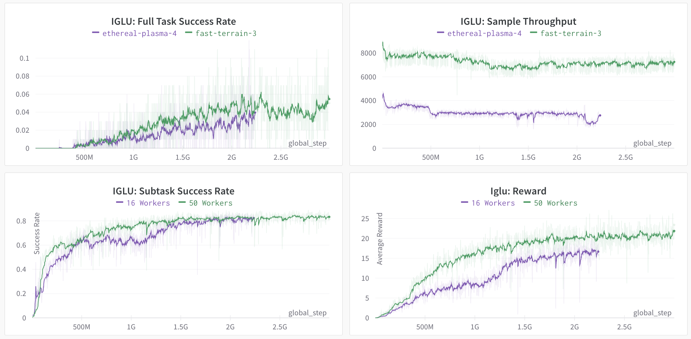

# **[NeurIPS 2022 - IGLU Challenge](https://www.aicrowd.com/challenges/neurips-2022-iglu-challenge)** - Baseline agent

Quick Links:

* [The IGLU Challenge - Competition Page](https://www.aicrowd.com/challenges/neurips-2022-iglu-challenge)
* [The IGLU Challenge - Slack Workspace](https://join.slack.com/t/igluorg/shared_invite/zt-zzlc1qpy-X6JBgRtwx1w_CBqOV5~jaA&sa=D&sntz=1&usg=AOvVaw33cSaYXeinlMWYC6bGIe33)
* [The IGLU Challenge - Starter Kit](https://gitlab.aicrowd.com/aicrowd/challenges/iglu-challenge-2022)


# Table of Contents
- [**NeurIPS 2022 - IGLU Challenge** - Baseline agent](#neurips-2022---iglu-challenge---baseline-agent)
- [Table of Contents](#table-of-contents)
- [Overview](#overview)
- [Baseline performance](#baseline-performance)
- [Visualization](#visualization)
- [Method description](#method-description)
  - [NLP Module (Task generator)](#nlp-module-task-generator)
  - [Heuristic Module (Subtask generator)](#heuristic-module-subtask-generator)
  - [RL module (Subtask solver)](#rl-module-subtask-solver)
- [Training data and process](#training-data-and-process)
- [Performance distribution](#performance-distribution)
- [Installation](#installation)
  - [Training APPO](#training-appo)
  - [Enjoy baseline](#enjoy-baseline)
- [Code structure](#code-structure)

# Overview

**Note:** before reading the baseline description, we highly encourage you to read the description in the competition [starter kit](https://gitlab.aicrowd.com/aicrowd/challenges/iglu-challenge-2022/iglu-2022-rl-task-starter-kit). Is document assumes familiarity with the RL [environment](https://github.com/iglu-contest/gridworld) and 

The Multitask Hierarchical Baseline (MHB) agent fully solves the IGLU RL task: it predicts which blocks needs to be placed from an instruction and then, it executes several actions in the evironment that lead to placements in responce to that instruction. It is comprised of three modules: NLP module that predicts blocks coordinates and ids given text, Heuristic module (pure python code) that iterates over the predicted blocks (where a heuristic defines order), and RL module that executes atomic task of one block placement or removal. The RL agent operates on a visual input, inventory, compass observation, and a target block.

# Baseline performance

Current baseline was trained in three days, the performance metrics are shown below.



Here, the two main metrics are Subtask Success rate and Task Success rate. The first one shows the success probability of one block placement. The second one shows the probability of sucess in building set of blocks in responce to an instruction (i.e. a chain of subtasks).

# Visualization

Below the visualization is shown. The agent is tasked to build a structure shown in the image. 


# Method description

## NLP Module (Task generator)

Text module predicts block coordinates and ids in an autoregressive fashion. It uses a finetuned [T5](https://huggingface.co/docs/transformers/model_doc/t5) encoder-decoder transformer. This model takes a dialog as an input and sparse blocks coordinates as outputs. The model was finetuned on the multiturn IGLU dataset available in the [azure storage](https://iglumturkstorage.blob.core.windows.net/public-data/iglu_dataset.zip) or in the [RL env](https://github.com/iglu-contest/gridworld) python package.


## Heuristic Module (Subtask generator)

This module is a pure python code that takes the output of the NLP module in the form of 3d voxel array of colored blocks, and creates a generator that yields blocks (one at a time) to add or remove, following certain heuristic. This is done since the RL module operates on one-block task basis. The heuristic rule is best described in the following animation:

Original figure (3D voxel)             |  Blocks order
:-------------------------:|:-------------------------:
 |  

## RL module (Subtask solver)

A reinforcement learning policy that takes a non-text part of an environment observation (agent's POV image, inventory state, compass), and a block to add or remove. Note that in case of several blocks added within environment episode, the RL agent "sees" them as several episodes (number of "internal" episodes is equal to the number of blocks). This is because its episodes are atomic and contain just one block to add/remove. The policy acts in the **walking** action space to have a better prior of building blocks on the ground. The model of the policy is uses 6-layers convolutional ResNet, with the same architecture as in the [IMPALA paper](https://arxiv.org/pdf/1802.01561.pdf). This model is used to process image and target grid (with shape `(9, 11, 11)` - (Y, X, Z)). The target grid is interpreted as an image with Y layers as channels. Once calculated, the ResNet embeddings of an image and a target are concatenated with an MLP embedding of compass and inventory and the whole vector is passed to the LSTM cell that output logits of a policy.

# Training data and process

One can view a problem of generating the grid by instructions as an NLP problem. Having a set of Architect (A) instructions we want to generate the textual commands to the Builder (B) in a form that can be parsed and interpeted automatically. A common way to do so is training a sequence-to-sequence model. We have fine-tuned the T5 model a widely-used seq2seq Transformer, pre-trained to do any text generation task depending on the input prefix. Thus in our task we simply prepend all inputs with the prefix: “implement given instructions: “.
Before the fine-tuning we have done the following data preprocessing: we have removed all builder’s utterances and concatenated separate architect’s utterances between different B actions into one sequence. Moreover we have replaced blocks’ coordinates in the B’s actions with their relative position with respect to the initial block and concatenated consequent actions into one sequence. Combining previous steps we have obtained a parallel dataset where each set of A utterances is corresponding to the sequence of B actions. Next, we augmented the dataset with all possible permutations of colours of blocks.
The biggest shortcoming of the described approach is that the model has no information about the current world state. In order to mitigate this issue we add the context to the input. We add the last 3 input-output pairs to the current input during fine-tuning. During inference we add the generated outputs to the context instead of the ground truth.

To train the RL module, we use a high-throughput [implementation](https://github.com/iglu-contest/sample-factory) of APPO algorithm. We train the model on a random tasks distribution, such that each sample is similar to the tasks in the dataset (in particular, multiturn [dataset](https://iglumturkstorage.blob.core.windows.net/public-data/iglu_dataset.zip)). We also modify the original reward function and set it to be proportional to the distance between the position of a placed block and it's target position (since the RL algorithm operates on a one block basis). We initialize the hidden state of LSTM of a polciy with zeros in the beginning of an episode and reset the hidden state once the target block is placed correctly. The model of a policy combines learned embeddings of image, target 3d array (where heights are interpreted as a channel), inventory and compass information in a single features vector that is passed to LSTM. We train the model for 2.5 billion environment steps using APPO. The performance (measured in a subtask success rate) plateaues after roughly 500 million environment steps (10-12 hours), but actual learning happens after since the task success rate starts growing exactly after that. For training we used two Titan RTX GPUs used for rendering and 50 workers for environment sampling. We observed the same per env step sample efficiency when trained with one renderer GPU and 16 workers (with lower wall time efficiency). Note that we believe a successful solution should not necessarily modify the RL agent. The baseline has a lot of moving parts such as NLP model and a heuristic blocks iterator.


# Installation

For this baseline version uses latest version of a `master` branch  from Iglu gridworld repository. You can install this version by the following command:

```bash
pip install git+https://github.com/iglu-contest/gridworld.git
```

Then install other requirements by running

```bash
pip install -r docker/requirements.txt
```

also, install a specific version of pytorch and sample-factor by running

```bash
pip3 install torch==1.8.1+cu111 torchvision==0.9.1+cu111 torchaudio==0.8.1 -f https://download.pytorch.org/whl/torch_stable.html 
pip3 install git+https://github.com/iglu-contest/sample-factory.git@1.121.3.iglu
pip3 install git+https://github.com/iglu-contest/gridworld.git@master
```

Alternatively, you can build the docker image to work with. This setup was tested and works stable:

```bash
./docker/build.sh
```

## Training APPO
Just run ```train.py``` with config_path:
```bash
python mhb_training/main.py --config_path iglu_baseline.yaml
```
## Enjoy baseline
Run ```enjoy.py``` :
```bash
python mhb_training/utils/enjoy.py
```

# Code structure

The code for NLP model is located at `agents/mhb_baseline/nlp_model`. 
The heuristic for blocks iteration is located at `wrappers/target_generator.py` (e.g. `target_to_subtasks` function, it implements the main algorithm for splitting the goal into subtasks).
In  `mhb_training/wrappers/multitask` you can find `TargetGenerator` and `SubtaskGenerator` classes. The first class makes full-figure target using `RandomFigure` generator or `DatasetFigure` generator.
The second class makes subtasks for environment. The training config for the RL agent is in `iglu_baseline.yaml`. Most of the training code is implemented in the [sample-factory](https://github.com/iglu-contest/sample-factory) package. Most of training curriculum is implemented via wrappers under `mhb_training/wrappers/` directory.

